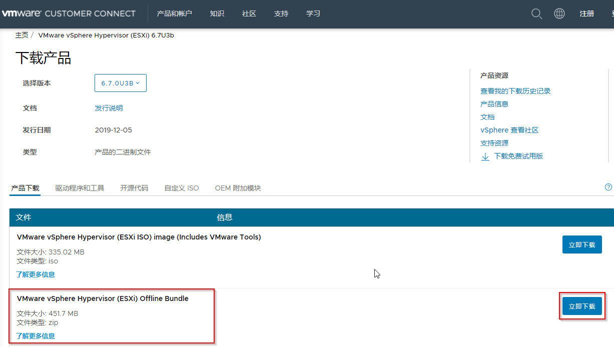
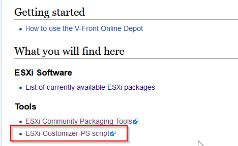
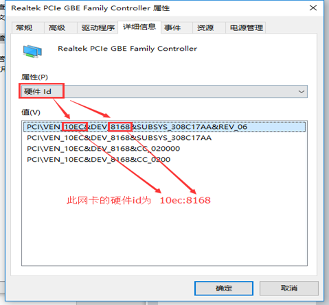
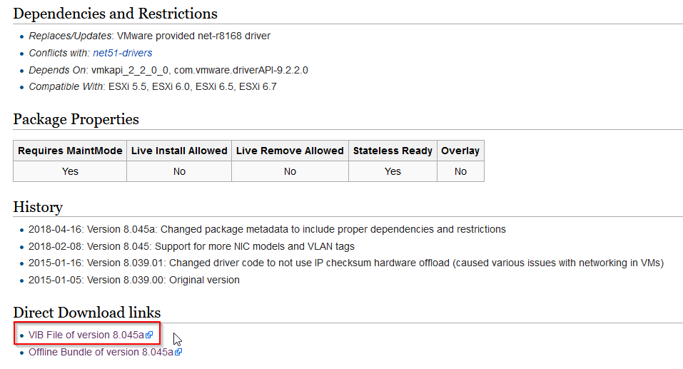

参考链接:https://www.cnblogs.com/zoulongbin/p/10361615.html

https://www.sohu.com/a/350392435_120351006

https://blogs.vmware.com/PowerCLI/2018/01/powercli-offline-installation-walkthrough.html

https://developer.vmware.com/powercli


1.下载ESXI离线镜像包

下载地址:https://my.vmware.com/cn/web/vmware/downloads/details?downloadGroup=ESXI67U3B&productId=742&rPId=61938




2.下载ESXi-Customizer-PS-v2.6.0.ps1脚本

首页:https://vibsdepot.v-front.de/wiki/index.php/Welcome

https://www.v-front.de/p/esxi-customizer-ps.html#download




3.准备ESXI6.7兼容版本的相关网卡型号驱动



网卡8168下载地址:https://vibsdepot.v-front.de/wiki/index.php/Net55-r8168




4.下载安装VMware PowerCLI

在powershell命令框分别执行两条命令打开RemoteSigned功能

```
Set-ExecutionPolicy -ExecutionPolicy RemoteSigned
Set-ExecutionPolicy Unrestricted
```


5.封装相关驱动到ESXI镜像包

运行VMware PowerCLI

```
cd "C:\Users\Administrator\Desktop\esxi tools"
.\ESXi-Customizer-PS-v2.6.0.ps1 -izip .\update-from-esxi6.7-6.7_update03.zip -pkgDir "C:\Users\Administrator\Desktop\esxi tools\vib"
```

ESXi-Customizer-PS-v2.6.0.ps1:脚本

update-from-esxi6.7-6.7_update03.zip:ESXI离线镜像包

vib:为存放驱动的目录